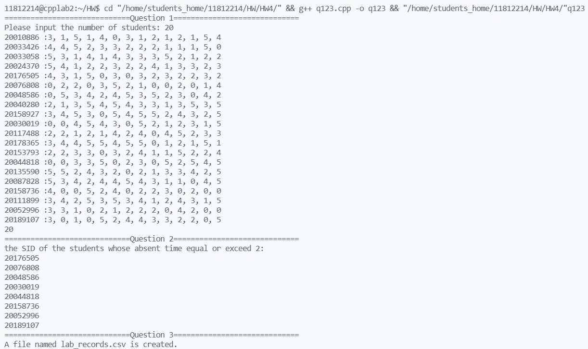
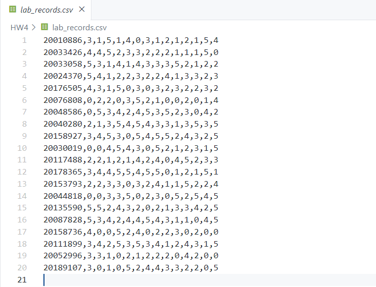
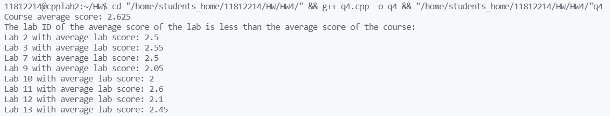
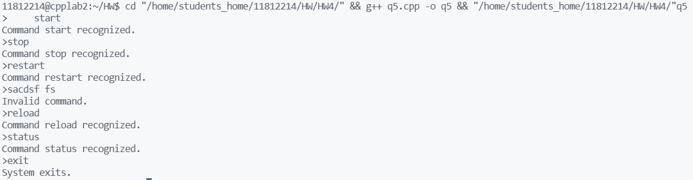

# CS205 C/ C++ Programming - Lab Assignment 4

**Name: **任振裕(Ren Zhenyu)

**SID: **11812214

## Part 1 - Analysis

+ Q1,2,3,4: file io.
+ Q5: switch the index of the array.

## Part 2 - Code

`q123.cpp`

```c++
#include <iostream>
#include <vector>
#include <set>
#include <fstream>
#define filename "lab_records.csv"

using namespace std;

struct Student
{
    string ID;
    int scores[14];
};

vector<Student> generateStu();
int randomInt(int low, int up);
void question2(vector<Student> &students);
void question3(vector<Student> &students);

int main()
{
    cout << "=============================Question 1=============================" << endl;
    vector<Student> students = generateStu();
    cout << students.size() << endl;
    cout << "=============================Question 2=============================" << endl;
    question2(students);
    cout << "=============================Question 3=============================" << endl;
    question3(students);
    cout << "A file named lab_records.csv is created." << endl;
    return 0;
}

vector<Student> generateStu()
{
    vector<Student> students;
    set<string> IDset;
    int n;
    cout << "Please input the number of students: ";
    cin >> n;
    for (int i = 0; i < n; i++)
    {
        Student stu;
        do
        {
            stu.ID = to_string(randomInt(2000, 2020) * 10000 + randomInt(0, 9999));
        } while (!IDset.insert(stu.ID).second);
        cout << stu.ID << " :";
        for (int i = 0; i < 13; i++)
        {
            stu.scores[i] = randomInt(0, 5);
            cout << stu.scores[i] << ", ";
        }
        stu.scores[13] = randomInt(0, 5);
        cout << stu.scores[13];
        students.push_back(stu);
        cout << endl;
    }
    return students;
}

int randomInt(int low, int up)
{
    // generate random Int from [1,5];
    return (low + rand() % (up - low + 1));
}

void question2(vector<Student> &students)
{
    int count;
    cout << "the SID of the students whose absent time equal or exceed 2: " << endl;
    for (Student &stu : students)
    {
        count = 0;
        for (int &score : stu.scores)
        {
            if (score == 0)
            {
                count++;
            }
            if (count >= 2)
            {
                cout << stu.ID << endl;
                break;
            }
        }
    }
}

void question3(vector<Student> &students)
{
    ofstream myfile(filename);
    if (!myfile.is_open())
    {
        cout << "Can not open " << filename << endl;
        exit(0);
    }
    for (Student &stu : students)
    {
        myfile << stu.ID;
        for (int &score : stu.scores)
        {
            myfile << "," << score;
        }
        myfile << "\n";
    }
    myfile.close();
}

```

`q4.cpp`

```c++
#include <iostream>
#include <fstream>
#include <vector>
#include <sstream>
using namespace std;

void spilit(string& s, char delim, vector<string> &elems);

int main() 
{
    string filename = "lab_records.csv";
    // cout<<"Please input the filename: "<<endl;
    // getline(cin,filename);
    ifstream myfile(filename);
    if (!myfile.is_open())
    {
        cout << "Can not open " << filename << endl;
        exit(0);
    }
    string temp;
    int stu_count = 0;
    int* lab_sum = new int[14];
    double* lab_average = new double[14]; 
    int course_sum;
    double course_average;
    while (getline(myfile,temp))
    {
        stu_count++;
        vector<string> elems;
        spilit(temp,',',elems);
        for (int i=0;i<14;i++)
        {
            lab_sum[i] += stoi(elems[i+1]);
            course_sum += stoi(elems[i+1]);
        }
    }
    course_average = (double) course_sum/(14*stu_count);
    cout << "Course average score: "<<course_average<<endl;
    cout << "The lab ID of the average score of the lab is less than the average score of the course: "<<endl;
    for (int i = 0; i < 14; i++)
    {
        lab_average[i] = (double) lab_sum[i]/stu_count;
        if (lab_average[i] < course_average)
        {
            cout << "Lab "<<(i+1)<<" with average lab score: "<<lab_average[i]<<endl;
        }    
    }
}

void spilit(string& s, char delim, vector<string> &elems)
{
    stringstream ss(s);
    string temp;
    while (getline(ss,temp,delim))
    {
        elems.push_back(temp);
    }
}
```

`q5.cpp`

```C++
#include <iostream>
#include <cstring>
using namespace std;

string trim(string &s)
{
    if (s.empty())
    {
        return "";
    }
    s.erase(0,s.find_first_not_of(" "));
    s.erase(s.find_last_not_of(" ")+1);
    return s;
}


int index(string commands[],int length, string command)
{
    for (int i = 0; i < length; i++)
    {
        if (commands[i] == command)
        {
            
            return i;
        }
    }
    return -1;
}

int main()
{
    string commands[] = {"start","stop","restart","reload","status","exit"};
    string command;
    while (true)
    {
        cout<<">";
        getline(cin,command);
        command = trim(command);
        for (int i = 0; i < command.length(); i++)
        {
            command[i] = tolower(command[i]);
        }
        switch (index(commands,6,command))
        {
        case 5:
            cout << "System exits."<<endl;
            exit(0);
            break;
        case -1:
            cout << "Invalid command."<<endl;
            break;
        default:
            cout << "Command " << command << " recognized."<<endl;
            break;
        }
    }
    
}
```

## Part 3 - Result & Verification

### Q1, Q2, and Q3

+ Input and output:





### Q4

+ Input and output:



### Q5

>Here we consider the functions of `trim` .

+ Input and output:



## Part 4 - Difficulties & Solutions

+ Use `getline` to implement `spilit`.

  